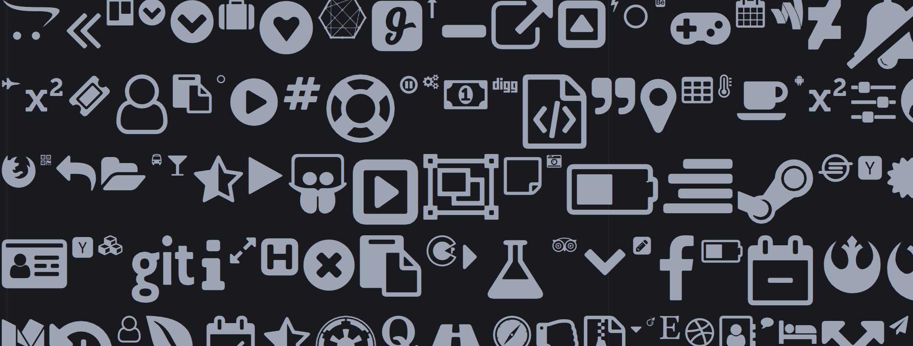

QMLFontAwesome
===

Resources for **[FontAwesome](http://fontawesome.io)** support in your **[QML](http://doc.qt.io/qt-5/qtqml-index.html)** application

	

##About
Some resources to get **[FontAwesome](http://fontawesome.io)** up and running in your **[QML](http://doc.qt.io/qt-5/qtqml-index.html)** application real quick. You'll need three simple steps:

1. **Copy** the resources into your project
	
	- [fontawesome-webfont.ttf](fontawesome-webfont.ttf)
	- [Icon.qml](Icon.qml)
	- [fontawesome.js](fontawesome.js)

	Just as how they fit best in your project structure. You'll probably have some *resources*, *fonts* and *qml source* folders to organize your project in one way or another

2. **Register** the font in C++ before application startup

 `QFontDatabase::addApplicationFont(path_to_font_awesome);`
 
3. **Access** icons in QML

		Icon {
			icon: icons.fa_thumbs_up;
		}

Check out the **[FontAwesome cheatsheet](http://fontawesome.io/cheatsheet/)** to find individual icon names. By convention, the same names are used as listed in the cheatsheet. The only difference is that dashes are replaced with underscores.

##License

Copyright (c) 2017, Alexander Eduard Szalo
All rights reserved.

Redistribution and use in source and binary forms, with or without modification, are permitted provided that the following conditions are met:

1. Redistributions of source code must retain the above copyright notice, this list of conditions and the following disclaimer.

2. Redistributions in binary form must reproduce the above copyright notice, this list of conditions and the following disclaimer in the documentation and/or other materials provided with the distribution.

3. Neither the name of the copyright holder nor the names of its contributors may be used to endorse or promote products derived from this software without specific prior written permission.

THIS SOFTWARE IS PROVIDED BY THE COPYRIGHT HOLDERS AND CONTRIBUTORS "AS IS" AND ANY EXPRESS OR IMPLIED WARRANTIES, INCLUDING, BUT NOT LIMITED TO, THE IMPLIED WARRANTIES OF MERCHANTABILITY AND FITNESS FOR A PARTICULAR PURPOSE ARE DISCLAIMED. IN NO EVENT SHALL THE COPYRIGHT HOLDER OR CONTRIBUTORS BE LIABLE FOR ANY DIRECT, INDIRECT, INCIDENTAL, SPECIAL, EXEMPLARY, OR CONSEQUENTIAL DAMAGES (INCLUDING, BUT NOT LIMITED TO, PROCUREMENT OF SUBSTITUTE GOODS OR SERVICES; LOSS OF USE, DATA, OR PROFITS; OR BUSINESS INTERRUPTION) HOWEVER CAUSED AND ON ANY THEORY OF LIABILITY, WHETHER IN CONTRACT, STRICT LIABILITY, OR TORT (INCLUDING NEGLIGENCE OR OTHERWISE) ARISING IN ANY WAY OUT OF THE USE OF THIS SOFTWARE, EVEN IF ADVISED OF THE POSSIBILITY OF SUCH DAMAGE.